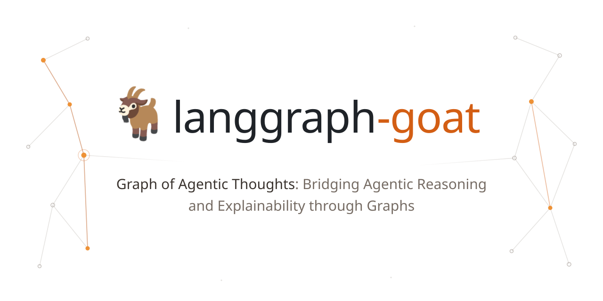
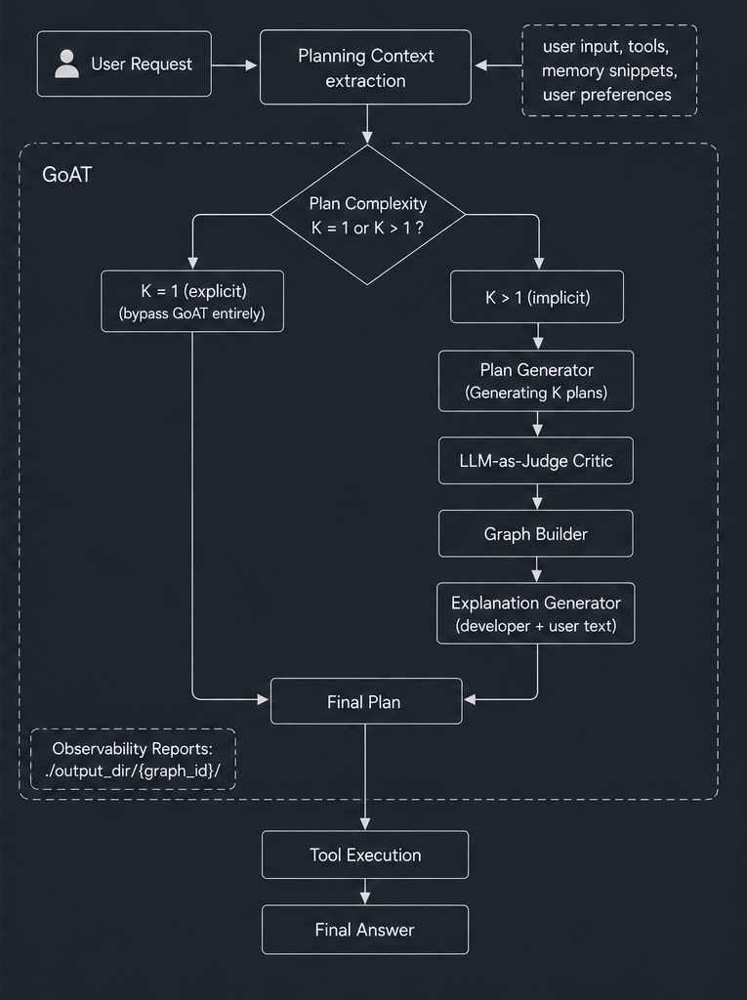

<div align="center">

<picture>
  <source media="(prefers-color-scheme: dark)" srcset="docs/goat-icon-dark.svg">
  <source media="(prefers-color-scheme: light)" srcset="docs/goat-icon-light.svg">
  
</picture>

**Counterfactual explainability for agentic planners**\
Your agent picked a plan. GoAT tells you what else it considered, what it scored, and why it lost.

[](https://www.python.org/downloads/)
[](https://opensource.org/licenses/MIT)
[](#project-status)

[Quickstart](#quickstart) · [Configuration](#configuration) · [Memory](#memory) · [Development](#development) · [Troubleshooting](#troubleshooting) · [Publication](#publication)

</div>

---

## Why GoAT 🐐

An ordinary agent emits *one* plan and executes it. Nothing records what else it could have done, or why it didn't. Failures are un-debuggable and decisions are un-auditable.

GoAT wraps the planning step. For a request it judges *complex*, it generates **multiple plans**, scores them with an **LLM-as-judge critic**, executes only the winner, and emits a **directed graph** whose *factual plan* is the winning plan and whose *counterfactual plan(s)* are the rejected alternatives — each carrying the critic's rejection reason on a counterfactual edge. It then renders that graph as two natural-language explanations, one for developers and one for end users.

<div align="center">

| Without GoAT | With GoAT |
|--------------|-----------|
| Single plan generated | Multiple diverse plans considered |
| No explanation of *why* | Clear explanation of plan selection |
| Black-box decision making | Transparent counterfactual reasoning |
| Hard to debug failures | Full graph of alternatives |

</div>

## Package

One distribution, one import surface:

```python
import langgraph_goat
from langgraph_goat import GoatMiddleware, GoatNode, GoatLogger
```

## Quickstart

GoAT offers two integration surfaces:

<div align="center">


| | `GoatMiddleware` | `GoatNode` |
|---|---|---|
| **Target API** | `create_agent` | your own `StateGraph` |
| **Setup** | drop-in, one line | wrap your planner node |
| **Control** | limited | full |
| **Best for** | standard LangChain agents | custom graph architectures |
| **Example** | [examples/agent_high_level.py](examples/agent_high_level.py) | [examples/agent_low_level.py](examples/agent_low_level.py) |

</div>

> GoAT **emits** plans as tool calls; it does not execute them. `create_agent` handles execution for you. A custom `StateGraph` needs a `ToolNode` downstream of the wrapped planner.

## How it works
<div align="center">
<picture>
  <source media="(prefers-color-scheme: light)" srcset="docs/flow-diagram-light.png">
  <source media="(prefers-color-scheme: dark)" srcset="docs/flow-diagram-dark.png">
  
</picture>
</div>
<details>
<summary><b>K resolution — exact precedence</b></summary>

1. `force_K` set → `K = clamp(force_K, 1, max_K)`, confidence `1.0`, classifier skipped.
2. Otherwise a classifier is present → its `suggested_K`, capped at `max_K` (the reason string records the cap).
3. Otherwise → `K = clamp(default_K, 1, max_K)`.

`Director.run` raises `ValueError` if K>1 with no critic configured.

</details>


## Reading the output

Both integration paths write the same keys. All are **absent when K=1** — always use `.get()`.

| Key | Type | Contents |
|-----|------|----------|
| `goat_graph` | `GoATGraph` | factual path + ghost nodes + edges |
| `goat_winning_plan_id` | `str` | the selected plan's id |
| `goat_complexity` | `PlanComplexity` | `needs_multiple_plans`, `suggested_K`, `reason`, `confidence` |
| `goat_explanation` | `Explanation` | `developer_explanation`, `user_explanation`, `raw_output` |
| `goat_director_result` | `DirectorResult` | `graph`, `winning_plan`, `all_plans`, `complexity`, `explanation` |
| `plan` | `list[dict]` | serialized winning plan — node wrapper only, back-compatible |

```python
if goat_graph = response.get("goat_graph"):
    print(f"GoAT Output: {goat_graph}")
```

`plan` step shape: `{"tool", "args", "justification", "step_id", "expected_output"}`.

### Artifacts

Each GoAT run writes to `{output_dir}/{graph_id}/`:

| File | Contents | Parameter |
|------|----------|-----------|
| `graph_{graph_id}.gv.svg` | GoAT graph created by GraphViz | `render_goat_graph` |
| `tele_{graph_id}.json` | every LLM call — prompts, completions, token counts, latency, pipeline errors | `render_goat_tele` |
| `tele_{graph_id}.html` | visualised report over the same data | `render_goat_tele` |
| `trace_{graph_id}.svg` | PlantUML sequence diagram of the run | `render_goat_trace` |

## GoAT Log

```python
from langgraph_goat import GoatLogger
GoatLogger("agent_name", level=logging.DEBUG)
```

## Configuration

There is no config file and no GoAT runtime environment variable. Everything goes through the two config dataclasses.

### `GoatMiddlewareConfig`

| Field | Type | Default | Purpose |
|-------|------|---------|---------|
| `classifier` | `PlanComplexityClassifier \| None` | `None` | custom complexity classifier; default `LLMClassifier` built from the agent's model |
| `critic` | `PlanCritic \| None` | `None` | custom critic; default `LLMJudgeCritic` |
| `explanation_generator` | `ExplanationGenerator \| None` | `None` | custom explainer; default `LLMExplanationGenerator` |
| `graph_store` | `GraphStore \| None` | `None` | graph is persisted in NetworkX Store if not provided |
| `store` | `Any \| None` | `None` | LangGraph store for memory retrieval |
| `default_K` | `int` | `3` | K when the classifier is absent or uncertain |
| `max_K` | `int` | `3` | hard cap on K |
| `force_K` | `int \| None` | `None` | bypasses the classifier entirely |
| `planning_prompt_template` | `str \| None` | `None` | custom plan-generation prompt |
| `output_dir` | `str` | `"./output"` | telemetry and report root directory |
| `callbacks` | `list \| None` | `None` | LangChain callback handlers for token/latency tracking |


**K is not a hyperparameter to max out.** Forcing K=5 on every query defeats adaptive explainability and multiplies cost.

### Static values

Not configurable without supplying your own components:

<div align="center">

| Component | `temperature` | `max_tokens` |
|-----------|---------------|--------------|
| Classifier | 0.3 | 1024 |
| Plan Generation | 0.7 | 2024 |
| Critic | 0.2 | 2500 |
| Explanation | 0.4 | 1500 | 

</div>

memory namespaces `[("preferences",), ("memory",), ("context",)]`.

## Memory

**GoAT never writes  — it only reads**. Persistence stays your application's job.

```python
from langgraph.store.memory import InMemoryStore

store = InMemoryStore()
store.put(("preferences",), "user_123", {"likes": ["hiking", "reading"], "budget": "moderate"})

config = GoatMiddlewareConfig(store=store)      # or GoatNodeConfig(store=store)
```

Retrieval searches exactly three namespaces — `("preferences",)`, `("memory",)`, `("context",)`. **Memories stored anywhere else are invisible.** Each hit is formatted `[<namespace>] <value>`. `store.search()` is preferred; stores without it fall back to `store.get(namespace, <raw user input>)`.

<details>
<summary><b>Postgres — long-term store plus checkpointer</b></summary>

`AsyncPostgresStore` takes a connection **pool**, not a connection string. The checkpointer (per-thread conversation state) is orthogonal to the store (cross-thread long-term memory GoAT reads).

```python
from psycopg_pool import AsyncConnectionPool
from psycopg.rows import dict_row
from langgraph.checkpoint.postgres.aio import AsyncPostgresSaver
from langgraph.store.postgres import AsyncPostgresStore

async with AsyncConnectionPool(conninfo=DSN, max_size=20,
                               kwargs={"row_factory": dict_row}) as pool:
    checkpointer = AsyncPostgresSaver(pool)
    await checkpointer.setup()

    store = AsyncPostgresStore(pool)
    await store.setup()
    await store.aput(("preferences",), "user_123", {"text": "prefers detailed, scientific style"})

    agent = create_agent(model=model, tools=ALL_TOOLS,
                         middleware=[GoatMiddleware(config)],
                         store=store, checkpointer=checkpointer)
```

Semantic search needs a pgvector embedding index; values must carry the indexed field (`"text"` by convention) for `asearch()` to match. Without pgvector, retrieval degrades to exact key lookups. Working reference: [examples/agent_high_level_postgres.py](examples/agent_high_level_postgres.py).

</details>

<details>
<summary><b>MarkdownStore — hand-editable memory</b></summary>

[examples/res/markdown_store.py](examples/res/markdown_store.py) is a LangGraph-compatible store backed by a single markdown file — `##` headers are namespaces, `###` headers are keys. It re-reads the file on every call, so **you can edit `memory.md` mid-session and the agent sees it immediately**. Search is case-insensitive substring matching, not semantic.

```python
store = MarkdownStore("memory.md")
```

</details>

## Extending GoAT

Every component is a Protocol. Match the shape and pass it in the config.

| Protocol | Method | Reference |
|----------|--------|-----------|
| `PlanComplexityClassifier` | `classify(context, trace_context=None) -> PlanComplexity` | [docs/custom_classifier_guide.md](docs/custom_classifier_guide.md) |
| `PlanGenerator` | `generate_K(context, K, trace_context=None) -> list[Plan]` |  |
| `PlanCritic` | `score(plans, context, trace_context=None) -> CriticVerdict` | [docs/custom_critic_guide.md](docs/custom_critic_guide.md) |
| `ExplanationGenerator` | `generate(graph, trace_context=None) -> Explanation` | [docs/custom_explanation_generator_guide.md](docs/custom_explanation_generator_guide.md) |
| `GraphStore` | `save(path, graph, trace_context=None) -> str` · `load(path, graph_id, ...)` · `list_recent(limit=20, ...)` | [docs/custom_graph_store_guide.md](docs/custom_graph_store_guide.md) |
| `LLMClient` | `complete(messages, model=None, temperature=0.7, max_tokens=2000, trace_context=None, **kwargs) -> str` | [examples/customllm.py](examples/customllm.py) |

## Development

### Build

#### Installation:

**Development mode**
```bash
pip install -e .
```

**Regular install**:
```bash
pip install .
```

#### After Making Code Changes

1. **Edit code** in `langgraph_goat/` (adapter) or `langgraph_goat/_core/` (engine)

2. **If using editable install** (`pip install -e .`):
   - Changes are reflected immediately, no rebuild needed
   - Just restart your Python process/tests

3. **If using regular install** or need to rebuild:
   ```bash
   pip install -e . --force-reinstall --no-deps
   ```

#### Clean Build

Remove build artifacts if encountering issues:
```bash
Remove-Item -Recurse -Force dist, build, *.egg-info -ErrorAction SilentlyContinue
pip install -e . --force-reinstall
```

## Troubleshooting

| Symptom | Likely cause | Fix |
|---------|--------------|-----|
| No `goat_*` fields | K was 1, or the pipeline fell back | grep logs for `Falling back`; check `"_goat_error" in result` on the wrapper path |
| K is always 1 | classifier too conservative, or the model ignores the classification prompt | `force_K=3` to confirm the rest works, then supply a custom classifier or a stronger model |
| `memory_snippets` always empty | no `store`, or namespace mismatch | store under `("preferences",)`, `("memory",)`, or `("context",)` — nothing else is searched |
| No telemetry files | collector not initialized, or write failed | `os.makedirs(output_dir, exist_ok=True)`; look for `Failed to write telemetry output:` |
| Plans not diverse | single model call, low temperature | custom `planning_prompt_template` that names distinct strategies per plan |

## Publication

Moushumi Mahato and Javaid Nabi. 2026. **Graph of Agentic Thoughts: Bridging Agentic Reasoning and Explainability through Graphs.** In Proceedings of the 13th ACM IKDD International Conference on Data Science (CODS '25). Association for Computing Machinery, New York, NY, USA, 243–252. https://doi.org/10.1145/3799830.3799871